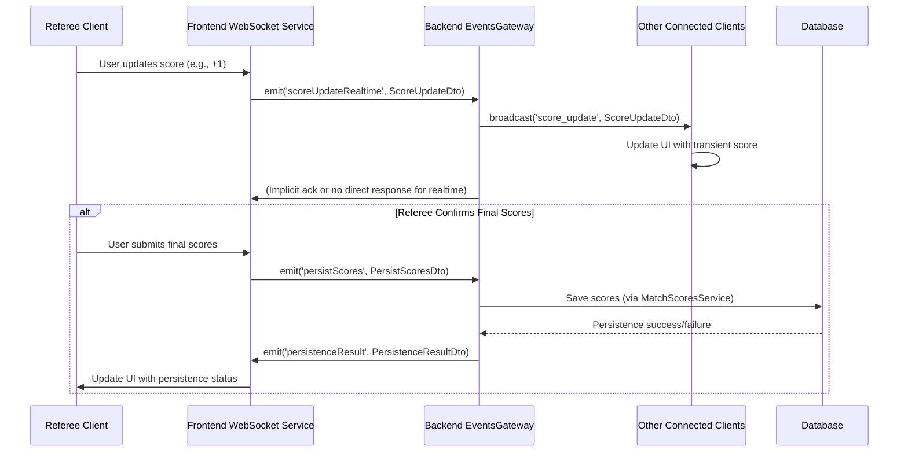

# WebSocket Implementation Plan

## 1. Overview for Non-Technical Stakeholders

Imagine our robotics tournament application needs to show live scores and match updates to everyone watching – referees, teams, and the audience – all at the exact same time, without anyone needing to refresh their page. That's what WebSockets do for us!

Think of it like a live phone call instead of sending letters back and forth. Once a connection is made, information can flow instantly in both directions.

**Key Benefits:**

*   **Real-time Updates:** Scores change on everyone's screen the moment they are entered. Timers count down live for all viewers.
*   **Instant Notifications:** Important announcements or match state changes (e.g., match starting, match paused) are broadcast immediately.
*   **Interactive Control:** Referees can control matches (start/stop timers, submit scores) and these actions are reflected live on other interfaces like the audience display.

In short, WebSockets make our application feel alive and interactive, ensuring everyone has the most up-to-date information instantly.

## 2. Technical Deep Dive

This section details the technical implementation of WebSocket communication within the Robotics Tournament Management System. It leverages Socket.IO, a library that enables real-time, bidirectional, and event-based communication.

### 2.1. Backend (NestJS - `EventsGateway`)

The core of the backend WebSocket functionality resides in `backend/src/websockets/events.gateway.ts`.

**Key Responsibilities:**

*   **Connection Management:** Handles client connections and disconnections.
*   **Room Management:** Uses Socket.IO rooms to broadcast messages to specific groups of clients. Typically, clients join rooms based on `tournamentId` and potentially `fieldId` to receive relevant updates.
    *   `join_tournament`: Client requests to join a room for a specific tournament.
    *   `leave_tournament`: Client requests to leave a tournament room.
    *   `joinFieldRoom`: Client requests to join a room for a specific field display (e.g., audience display for Field 1).
    *   `leaveFieldRoom`: Client requests to leave a field room.
*   **Message Handling (`@SubscribeMessage`):** Listens for specific events emitted by clients and processes them. Key events include:
    *   `scoreUpdateRealtime`: Handles incoming real-time score adjustments from a client (e.g., a referee's tablet). This typically involves broadcasting the update to other clients in the same tournament/match room but *does not* persist to the database directly through this event. The DTO used is `ScoreUpdateDto`.
    *   `persistScores`: Handles requests from clients to save scores to the database. This is a separate event from `scoreUpdateRealtime` to clearly distinguish between transient updates and final persistence. The DTO used is `PersistScoresDto`. After attempting persistence, the gateway emits a `persistenceResult` event back to the originating client (and potentially others) with `PersistenceResultDto`.
    *   `timer_update`, `start_timer`, `pause_timer`, `reset_timer`: Manage match timers.
    *   `match_state_change`: Handles changes in the match state (e.g., SCHEDULED, RUNNING, PAUSED, COMPLETED).
    *   `display_mode_change`: Updates audience display settings.
    *   `announcement`: Broadcasts announcements.
*   **Broadcasting Events (`server.to(room).emit()`):** Emits events to all clients in a specific room or globally. This is how real-time updates are disseminated.
    *   `broadcastToTournament(tournamentId, event, payload)`: Helper to send to a specific tournament room.
    *   `emitToField(fieldId, event, payload)`: Helper to send to a specific field room.

**DTOs (Data Transfer Objects) in `backend/src/websockets/dto/`:**

*   `BaseScoreDto.ts`: A base DTO likely containing common score fields (red/blue scores for auto/drive/total). *(Assumption, as its content is not provided)*
*   `ScoreUpdateDto.ts`: Extends `BaseScoreDto`. Used for `scoreUpdateRealtime` events. Includes a `type: 'realtime'` field.
*   `PersistScoresDto.ts`: Extends `BaseScoreDto`. Used for `persistScores` events. Includes `type: 'persist'`, `finalScores: boolean`, and `submittedBy: string` fields.
*   `PersistenceResultDto.ts`: Used to inform clients about the outcome of a score persistence attempt. Contains `matchId`, `success`, optional `data` or `error`, and `timestamp`.

**Workflow Example (Score Update & Persist):**

1.  **Referee UI (Client):** Referee increments a score element.
2.  **Client Emits `scoreUpdateRealtime`:** The frontend sends a `ScoreUpdateDto` to the `EventsGateway` with the new (transient) score.
3.  **`EventsGateway` Broadcasts:** The gateway broadcasts this `ScoreUpdateDto` to all clients in the relevant tournament/match room (e.g., other referees, audience display).
4.  **Clients Update UI:** Connected clients receive the `scoreUpdateRealtime` event and update their displays with the new transient score.
5.  **Referee UI (Client):** Referee confirms final scores for the match.
6.  **Client Emits `persistScores`:** The frontend sends a `PersistScoresDto` to the `EventsGateway`.
7.  **`EventsGateway` Processes:** The gateway calls the `MatchScoresService` (or similar) to save the scores to the database.
8.  **`EventsGateway` Emits `persistenceResult`:** The gateway sends a `PersistenceResultDto` back to the client indicating success or failure of the database operation.

### 2.2. Frontend (Next.js)

The frontend WebSocket integration is primarily managed through custom hooks and services.

**Key Files & Responsibilities:**

*   **`frontend/src/lib/websocket.ts` (Main WebSocket Service - `WebSocketService` class):**
    *   **Singleton Instance:** Provides a global singleton instance (`webSocketService`) for managing the WebSocket connection and event handling throughout the application.
    *   **Connection Management (`IConnectionManager`):** Handles `connect`, `disconnect`, `isConnected`, `getConnectionStatus`, `forceReconnect`. It also exposes `onConnectionStatus` for other parts of the app to react to connection changes.
    *   **Event Emission/Subscription (`IEventEmitter`):** Provides generic `emit`, `on`, and `off` methods for sending and receiving any WebSocket event.
    *   **Score Management (`IScoreManager`):** Offers specialized methods for score-related WebSocket interactions:
        *   `sendRealtimeScoreUpdate(data: BaseScoreData)`: Emits a `scoreUpdateRealtime` event (likely using `ScoreUpdateDto`).
        *   `persistScores(data: BaseScoreData)`: Emits a `persistScores` event (likely using `PersistScoresDto`) and probably handles the `persistenceResult` response via a Promise or callback.
        *   `onScoreUpdate(callback)`: Subscribes to incoming `scoreUpdateRealtime` events.
        *   `onScoresPersisted(callback)`: Subscribes to incoming `persistenceResult` events.
    *   **Legacy Support (`ILegacySupport`):** Provides methods for older event structures or specific event emissions like `joinTournament`, `sendDisplayModeChange`, etc. This seems to be a bridge or an abstraction layer over the basic `emit`.
    *   **Structure:** This service is well-structured using composition, with internal classes like `ConnectionManager`, `EventEmitter`, `ScoreManager`, and `LegacySupport` each handling a single responsibility. It also uses interfaces for better abstraction (`IConnectionManager`, `IEventEmitter`, etc.).

*   **`frontend/src/services/websocket-service.ts` (Alternative/Potentially Older Service):**
    *   This file also defines a `WebSocketService` using a `SocketIOConnection` class. It appears to be an alternative or perhaps an earlier version of the WebSocket service compared to `lib/websocket.ts`.
    *   It also provides methods for connecting, disconnecting, emitting, and subscribing to events, as well as specific convenience methods like `sendMatchUpdate`, `sendScoreUpdate`.
    *   **Note:** It's important to clarify which of these two services (`lib/websocket.ts` or `services/websocket-service.ts`) is the current, canonical one being used throughout the application to avoid confusion. The one in `lib/websocket.ts` appears more recent and robust due to its SOLID principles application and clear interface segregation.

*   **`frontend/src/hooks/common/websocket-context.tsx` (`WebSocketProvider`, `useWebSocketContext`):**
    *   Provides a React Context for the main `websocketService` instance (from `lib/websocket.ts`).
    *   `WebSocketProvider` wraps parts of the application (likely the root) to make the WebSocket service and connection status available via the `useWebSocketContext` hook.
    *   This avoids prop drilling and allows any component to access WebSocket functionalities.
    *   Manages and broadcasts connection status (`isConnected`, `connectionAttempts`).

*   **`frontend/src/hooks/common/use-optimized-websocket.ts` (`useOptimizedWebSocket`):**
    *   A custom hook that consumes `useWebSocketContext`.
    *   Aims to provide memoized actions to prevent unnecessary re-renders in components that use WebSocket functionalities.
    *   Separates actions into `coreActions` (connection, generic subscribe/unsubscribe), `tournamentActions` (join/leave tournament), and `contextualActions` (actions that depend on the current tournament, like sending tournament-specific data).

*   **`frontend/src/hooks/features/use-websocket-subscriptions.ts`:**
    *   A higher-level hook designed for components that need to subscribe to multiple common WebSocket events related to a tournament, field, or match (e.g., timer updates, score updates, match state changes).
    *   Takes `tournamentId`, `selectedFieldId`, `selectedMatchId`, and callbacks (`onTimerUpdate`, `onScoreUpdate`, etc.) as props.
    *   Uses `useWebSocket` (likely `useOptimizedWebSocket` or a similar hook deriving from the context) to get connection and subscription capabilities.
    *   Manages joining/leaving tournament and field rooms based on props.
    *   Sets up `useEffect` hooks to subscribe to specific events (`timer_update`, `score_update`, `match_update`, `match_state_change`) and calls the provided callbacks or updates TanStack Query cache when data is received.

*   **`frontend/src/hooks/features/use-realtime-scores.ts`:**
    *   A specialized hook for managing and displaying real-time scores for a specific `matchId`.
    *   Internally manages `realtimeScores` state and `connectionState` (including fallback mode).
    *   Likely uses `websocketService.onScoreUpdate()` (from `lib/websocket.ts`) to listen for live score broadcasts.
    *   Implements a `FallbackManager` for polling scores via HTTP if the WebSocket connection is down or unreliable, ensuring data can still be fetched (graceful degradation).
    *   Uses a `ScoreUpdater` to abstract the logic of updating the local score state from either WebSocket events or database polling results.

**Frontend Workflow Summary:**

1.  `WebSocketProvider` initializes `websocketService` and makes it available via context.
2.  Components or feature-specific hooks like `useWebSocketSubscriptions` or `useRealtimeScores` use `useWebSocketContext` (often via `useOptimizedWebSocket`) to access the service.
3.  They use methods like `joinTournament`, `joinFieldRoom` to subscribe to relevant server-side rooms.
4.  They use `subscribe` (or specialized methods like `onScoreUpdate`) to listen for events from the server.
5.  When events are received, callbacks are triggered, which might update local component state, TanStack Query cache, or perform other UI actions.
6.  To send data, they use `emit` (or specialized methods like `sendRealtimeScoreUpdate`, `persistScores`).

### 2.3. Key WebSocket Events (Client <-> Server)

*(This is a summary based on observed `SubscribeMessage` decorators and frontend service methods)*

**Client to Server:**

*   `join_tournament` (payload: `{ tournamentId: string }`)
*   `leave_tournament` (payload: `{ tournamentId: string }`)
*   `joinFieldRoom` (payload: `{ fieldId: string }`)
*   `leaveFieldRoom` (payload: `{ fieldId: string }`)
*   `scoreUpdateRealtime` (payload: `ScoreUpdateDto`)
*   `persistScores` (payload: `PersistScoresDto`)
*   `start_timer` (payload: `TimerData` - structure inferred)
*   `pause_timer` (payload: `TimerData`)
*   `reset_timer` (payload: `TimerData`)
*   `match_state_change` (payload: `MatchStateData` - structure inferred)
*   `display_mode_change` (payload: `AudienceDisplaySettings` - structure inferred)
*   `announcement` (payload: `AnnouncementData` - structure inferred)
*   `match_update` (payload: `MatchData` - structure inferred, less common for client to send full match updates, might be for specific control actions)

**Server to Client:**

*   `score_update` (payload: `ScoreUpdateDto` or similar `ScoreData`)
*   `persistenceResult` (payload: `PersistenceResultDto`)
*   `timer_update` (payload: `TimerData`)
*   `match_state_change` (payload: `MatchStateData`)
*   `match_update` (payload: `MatchData`)
*   `display_mode_update` (payload: `AudienceDisplaySettings` - event name assumed)
*   `announcement` (payload: `AnnouncementData`)
*   `connect`, `disconnect` (standard Socket.IO events)
*   `error` (generic error messages)

## 3. Data Flow Diagram (Simplified Score Update)

## 4. Future Considerations / Improvements

*   **Scalability:** For very large tournaments, investigate more advanced Socket.IO scaling strategies (e.g., Redis adapter).
*   **Error Handling:** Enhance client-side and server-side error handling and reporting for WebSocket operations.
*   **Security:** Review CORS origins for production. Implement stricter validation and sanitization on all incoming WebSocket messages on the backend.
*   **Message Schema Versioning:** For long-term maintenance, consider a strategy for versioning WebSocket message schemas if significant changes are anticipated.
*   **Consolidate Frontend Services:** Clarify and potentially merge the functionalities of `frontend/src/lib/websocket.ts` and `frontend/src/services/websocket-service.ts` if there's an overlap to maintain a single source of truth for WebSocket interactions.
*   **Testing:** Implement comprehensive automated tests for WebSocket event handling on both frontend and backend.

This document provides a foundational understanding of the WebSocket implementation. Refer to the specific source code files for the most detailed and up-to-date information.
