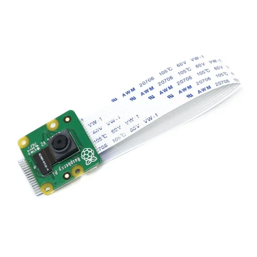

# Lời mở đầu

Hướng dẫn này sẽ giúp đội chơi có thể tự làm một module camera để làm quen trước sự kiện. 
Lưu ý tại sự kiện chính thức các bạn sẽ sử dụng module của ban tổ chức, hướng dẫn này sẽ giúp các đội tạo module giống như phiên bản sẽ có trong sự kiện.
BTC khuyến khích các đội làm tuần tự các bước trong #Thiết lập lần đầu, sau đó các hướng dẫn điều chỉnh và các lưu ý đi kèm sẽ có ở các phần sau.

# Yêu cầu
*   **Raspberry Pi Zero 2W**
    
*   **Raspberry Pi Camera Module V2**
    
*   **Thẻ nhớ microSD**: Ưu tiên sử dụng thẻ nhớ Sandisk Ultra SDHC (class 10) với dung lượng tối thiểu là 16GB.
    
*   **Cáp chuyển camera Raspberry Pi Zero**
    
*   **Pin 18650**
   
*   **Mạch hạ áp LM2596**: Khuyến nghị sử dụng mạch có màn hình hiển thị điện áp cho dễ sử dụng.
    
*   **Cáp microUSB**: Yêu cầu cáp microUSB có khả năng truyền dữ liệu.
    
*   **Máy tính**: Một máy tính chạy Windows, macOS, hoặc Linux để tải Raspberry Pi Imager, ghi hệ điều hành lên thẻ nhớ để sử dụng cho Raspberry Pi và sử dụng để theo dõi hình ảnh camera. Để đạt hiệu quả tốt nhất, khuyến nghị sử dụng máy tính có cổng Ethernet.
*   **Router không dây**: Bạn có thể sử dụng router nhà bạn đang sử dụng. Tuy nhiên để đạt hiệu năng tốt nhất chúng tôi khuyến nghị bạn sử dụng router không dây chuyên biệt sử dụng chuẩn N trở lên hay còn gọi là WiFi 4 trở lên (các router từ năm 2015 trở đi đều đáp ứng chuẩn này).
* **[Hộp chứa camera](https://husteduvn-my.sharepoint.com/:u:/r/personal/huy_nq2417439_sis_hust_edu_vn/Documents/STEAM%20for%20Vietnam/CAD/FireBot/Camera%20Box/Ver%201/Ver%201.STEP?csf=1&web=1&e=k1KMQh)**: Hộp này sẽ chứa các linh kiện cần thiết để có thể dễ dàng gắn camera.

:::info
Nếu bạn chỉ cần trải nghiệm camera, bạn sẽ chỉ cần tối thiểu mạch Raspberry Pi Zero 2W, Camera Module V2, thẻ nhớ microSD, nguồn cấp bất kỳ (có thể là cáp microUSB không cần có khả năng truyền dữ liệu) và một mạng WiFi bất kỳ mà bạn có quyền truy cập.
:::

### Nguồn mua đề xuất:
Dưới đây là những nguồn mua được chúng tôi mua và sử dụng cho module chính thức:
 * [**Raspberry Pi Zero 2W**](https://raspberrypi.vn/san-pham/raspberry-pi-zero-2-w-wireless)
 * [**Raspberry Pi Camera Module V2 - Hshop**](https://hshop.vn/camera-raspberry-pi-v2-8mp) hoặc [**Raspberry Pi Camera Module V2 - Raspberry Pi Viet Nam**](https://raspberrypi.vn/san-pham/raspberry-pi-camera-module-v2-8mp)
 * [**Thẻ nhớ microSD**](https://raspberrypi.vn/san-pham/nho-microsd-sandisk-ultra-16gb-toc-48mbs)
 * [**Cáp chuyển camera Raspberry Pi Zero**](https://raspberrypi.vn/san-pham/cap-chuyen-camera-raspberry-pi-zero)
 * [**Cáp chuyển Camera**](https://raspberrypi.vn/san-pham/cap-chuyen-camera-raspberry-pi-zero)
 * [**Pin 18650**](https://www.thegioiic.com/pin-sac-lithium-18650-1800mah-5c-3-7v)
 * [**Mạch hạ áp LM2596**](https://nshopvn.com/product/mach-giam-ap-dc-lm2596-co-hien-thi/)
 * [**Cáp microUSB**](https://linhkienvietnam.vn/day-cap-micro-usb)
:::danger
Trong quá trình lựa chọn mua thẻ microSD, hãy chọn nguồn mua uy tín, chất lượng. Sử dụng thẻ giả có thể làm giảm hiệu năng của thiết bị, hoặc thậm chí không thể sử dung được
:::

:::info
Lựa chọn dây microUSB có khả năng truyền dữ liệu, có rất nhiều báo cáo không thể kết nối với thiết bị qua Serial, đa phần nguyên do cáp microUSB không truyền được dữ liệu
:::

# Thiết lập lần đầu.


## Phần 1: Chuẩn bị phần cứng và Cài đặt Raspberry Pi OS

Trước khi bắt đầu, bạn cần đảm bảo có đủ các thành phần phần cứng sau đây. Việc lựa chọn đúng và đủ phần cứng sẽ giúp quá trình cài đặt và vận hành sau này được suôn sẻ.


### 1.1. Hướng dẫn cài đặt Raspberry Pi OS Lite (64bit) bằng Raspberry Pi Imager

Raspberry Pi Imager là công cụ chính thức và được khuyến nghị để cài đặt hệ điều hành cho Raspberry Pi. Nó giúp đơn giản hóa quá trình tải xuống image và ghi vào thẻ nhớ, đồng thời cho phép tùy chỉnh một số cài đặt cơ bản trước khi khởi động lần đầu.

**Bước 1: Tải và cài đặt Raspberry Pi Imager**

*   Truy cập trang web chính thức của Raspberry Pi: [https://www.raspberrypi.com/software/](https://www.raspberrypi.com/software/)
*   Tải xuống phiên bản Raspberry Pi Imager phù hợp với hệ điều hành máy tính của bạn (Windows, macOS, hoặc Ubuntu).
*   Cài đặt Raspberry Pi Imager theo hướng dẫn trên màn hình.

**Bước 2: Chuẩn bị thẻ nhớ**

*   Cắm thẻ nhớ MicroSD vào máy tính của bạn thông qua đầu đọc thẻ nhớ hoặc khe cắm thẻ nhớ tích hợp.
* Nếu thẻ nhớ đã được sử dụng trước đó, bạn có thể muốn sao lưu dữ liệu quan trọng trước khi tiến hành.

    :::danger 
    #### CẢNH BÁO XÓA DỮ LIỆU
    Quá trình ghi image sẽ **xóa toàn bộ dữ liệu** hiện có trên thẻ nhớ. Hãy đảm bảo bạn đã sao lưu tất cả thông tin quan trọng trước khi tiếp tục.
    :::

**Bước 3: Sử dụng Raspberry Pi Imager để ghi hệ điều hành**

1.  Mở ứng dụng Raspberry Pi Imager.
2.  Nhấp vào nút **"CHOOSE DEVICE"** và chọn model Raspberry Pi của bạn. Trong trường hợp này, hãy chọn **"Raspberry Pi Zero 2 W"**.
3.  Nhấp vào nút **"CHOOSE OS"**. Một danh sách các hệ điều hành sẽ hiện ra. Di chuyển đến mục **"Raspberry Pi OS (other)"** và chọn **"Raspberry Pi OS Lite (64-bit)"**. Phiên bản Lite không có giao diện đồ họa, giúp tiết kiệm tài nguyên và phù hợp cho các ứng dụng máy chủ hoặc thiết bị nhúng như camera.
4.  Nhấp vào nút **"CHOOSE STORAGE"** và chọn thẻ nhớ MicroSD bạn đã cắm vào máy tính.
5.  Sau khi đã chọn thiết bị, hệ điều hành và bộ nhớ lưu trữ, nút **"NEXT"** sẽ xuất hiện. Nhấp vào nút này để tiếp tục.

### 1.3. Hướng dẫn tùy chỉnh các thông số quan trọng trong Raspberry Pi Imager

Trước khi bắt đầu quá trình ghi, Raspberry Pi Imager sẽ hỏi bạn có muốn tùy chỉnh hệ điều hành không ("Would you like to apply OS customisation?"). Nhấp vào **"EDIT SETTINGS"** để cấu hình các thông số quan trọng sau. Việc này rất hữu ích vì nó cho phép bạn thiết lập các thông tin cần thiết để Raspberry Pi có thể tự động kết nối mạng và cho phép truy cập SSH ngay sau khi khởi động lần đầu.

1.  **Set hostname**: Đặt tên cho Raspberry Pi của bạn. Tên này sẽ được sử dụng để truy cập thiết bị trong mạng nội bộ. Nên chọn một tên duy nhất và dễ nhớ, ví dụ: `s4v-cam1`. Đánh dấu vào ô "Set hostname" và nhập tên mong muốn. Tên miền `.local` sẽ tự động được thêm vào (ví dụ: `s4v-cam1.local`).

2.  **Set username and password**: Tạo một tài khoản người dùng và mật khẩu để đăng nhập vào Raspberry Pi.


:::danger 
#### LƯU Ý QUAN TRỌNG
Ghi nhớ kỹ thông tin tài khoản (tên người dùng và mật khẩu) bạn tạo ở bước này. Bạn sẽ cần chúng để truy cập SSH và thực hiện các thao tác quản trị sau này. Mất thông tin này có thể khiến bạn không thể truy cập vào thiết bị.
:::

Đánh dấu vào ô "Set username and password", nhập tên người dùng (ví dụ: `pi` hoặc một tên khác bạn muốn) và mật khẩu.

3.  **Configure wireless LAN**: Cấu hình kết nối Wi-Fi. Đánh dấu vào ô "Configure wireless LAN".
    *   **SSID**: Nhập tên mạng Wi-Fi.
    *   **Password**: Nhập mật khẩu mạng Wi-Fi.

4.  **Set locale settings**: Cấu hình múi giờ và layout bàn phím. Thông thường, bạn có thể để các giá trị mặc định hoặc điều chỉnh cho phù hợp với vị trí của mình.
    *   **Time zone**: Chọn múi giờ của bạn (ví dụ: `Asia/Ho_Chi_Minh`).
    *   **Keyboard layout**: Chọn layout bàn phím (ví dụ: `us`).

5.  Chuyển sang tab **"SERVICES"**.
    *   **Enable SSH**: Đây là bước cực kỳ quan trọng để có thể điều khiển Raspberry Pi từ xa.

        :::info QUAN TRỌNG
        Đảm bảo rằng tùy chọn **"Enable SSH"** được chọn. Nếu không kích hoạt SSH, bạn sẽ không thể truy cập Raspberry Pi từ xa qua mạng sau khi cài đặt, trừ khi bạn sử dụng USB Serial Gadget (sẽ được cấu hình sau).
        :::
        Đảm bảo rằng tùy chọn **"Enable SSH"** được chọn.
    *   Chọn **"Use password authentication"**.

6.  Sau khi đã hoàn tất các tùy chỉnh, nhấp vào nút **"SAVE"**.

7.  Bây giờ, Raspberry Pi Imager sẽ hiển thị một cảnh báo rằng tất cả dữ liệu trên thẻ nhớ sẽ bị xóa. Nhấp vào **"YES"** để xác nhận và bắt đầu quá trình ghi hệ điều hành.

8.  Chờ cho đến khi Raspberry Pi Imager hoàn tất quá trình ghi và xác minh dữ liệu. Quá trình này có thể mất vài phút tùy thuộc vào tốc độ của thẻ nhớ và máy tính của bạn.

9.  Sau khi hoàn tất, bạn sẽ nhận được thông báo. Nhấp vào **"CONTINUE"** và sau đó bạn có thể rút thẻ nhớ ra khỏi máy tính một cách an toàn.

Tham khảo thêm thông tin và hình ảnh minh họa tại: [https://raspberrypi.vn/huong-dan-cai-dieu-hanh-cho-raspberry-pi-2457.pi](https://raspberrypi.vn/huong-dan-cai-dieu-hanh-cho-raspberry-pi-2457.pi) 

Tiếp theo, chúng ta sẽ tiến hành đăng nhập và thực hiện các cấu hình sâu hơn trên Raspberry Pi.

## Phần 2: Đăng nhập và Cấu hình USB Serial Gadget

Sau khi đã chuẩn bị thẻ nhớ với hệ điều hành được cài đặt và tùy chỉnh, bước tiếp theo là khởi động Raspberry Pi, đăng nhập và cấu hình USB Serial Gadget. Tính năng này cho phép bạn truy cập dòng lệnh của Raspberry Pi thông qua kết nối USB trực tiếp với máy tính, mà không cần đến kết nối mạng Wi-Fi hoặc Ethernet.

### 2.1. Đăng nhập vào hệ điều hành

1.  **Gắn thẻ nhớ và kết nối phần cứng:**
    *   Cẩn thận lắp thẻ nhớ MicroSD đã cài đặt Raspberry Pi OS vào khe cắm thẻ nhớ trên Raspberry Pi Zero 2W.
    *   Kết nối Camera RPi vào cổng CSI trên bo mạch. Đảm bảo cáp được cắm đúng chiều và chắc chắn.
    *   Kết nối nguồn điện cho Raspberry Pi Zero 2W. Trong lần khởi động đầu tiên này, hãy sử dụng cổng Micro-USB có nhãn **"PWR IN"**.

2.  **Chờ Raspberry Pi khởi động:**
    *   Sau khi cấp nguồn, Raspberry Pi sẽ tự động khởi động. Đèn LED ACT (màu xanh lá) sẽ nhấp nháy để báo hiệu hoạt động đọc/ghi thẻ nhớ. Quá trình khởi động lần đầu có thể mất vài phút (thường khoảng 3-5 phút) để hệ điều hành hoàn tất các thiết lập ban đầu.

3.  **Truy cập SSH vào Raspberry Pi:**
    *   Đảm bảo máy tính của bạn và Raspberry Pi đang kết nối cùng một mạng Wi-Fi (thông tin Wi-Fi đã được cấu hình trong Raspberry Pi Imager).
    *   Mở một cửa sổ Terminal (trên macOS hoặc Linux) hoặc PowerShell/Command Prompt (trên Windows).
    *   Sử dụng lệnh SSH để kết nối đến Raspberry Pi. Bạn sẽ sử dụng hostname đã đặt ở bước tùy chỉnh trong Raspberry Pi Imager. Ví dụ, nếu bạn đặt hostname là `s4v-cam1` và tên người dùng là `pi`, lệnh sẽ là:
        ```bash
        ssh pi@s4v-cam1.local
        ```
        Nếu bạn sử dụng Windows và chưa cài đặt OpenSSH client, bạn có thể dùng các ứng dụng SSH client khác như PuTTY.
    *   Lần đầu kết nối, bạn có thể nhận được một cảnh báo về tính xác thực của máy chủ (authenticity of host). Gõ `yes` và nhấn Enter để tiếp tục.
    *   Nhập mật khẩu bạn đã tạo cho người dùng khi được yêu cầu. Sau khi nhập đúng mật khẩu, bạn sẽ đăng nhập thành công vào dòng lệnh của Raspberry Pi OS.

**Bước 4: Tắt Raspberry Pi**

Sau khi hoàn tất các thay đổi cấu hình, hãy tắt Raspberry Pi một cách an toàn:

```bash
sudo shutdown now
```

Đợi cho đến khi đèn LED ACT ngừng nhấp nháy hoàn toàn, báo hiệu Raspberry Pi đã tắt hẳn. Sau đó, rút nguồn khỏi cổng "PWR IN".

**Bước 5: Kết nối và sử dụng USB Serial Gadget**

1.  **Cấp nguồn qua cổng USB dữ liệu**: Bây giờ, thay vì cấp nguồn qua cổng "PWR IN", hãy sử dụng một cáp USB Micro-B sang USB-A để kết nối cổng USB Micro-B có nhãn **"USB"** (cổng dữ liệu, không phải cổng PWR IN) trên Raspberry Pi Zero 2W với một cổng USB trên máy tính của bạn. Cổng này sẽ vừa cấp nguồn cho Pi, vừa thiết lập kết nối dữ liệu cho serial gadget.

2.  **Xác định cổng Serial:**
    *   **Trên macOS:** Mở Terminal và chạy lệnh:
        ```bash
        ls /dev/cu.usbmodem*
        ```
        Bạn sẽ thấy một thiết bị mới xuất hiện, ví dụ: `/dev/cu.usbmodem12345` hoặc tương tự. Đây chính là cổng serial của Raspberry Pi.
    *   **Trên Linux:** Mở Terminal và chạy lệnh:
        ```bash
        ls /dev/ttyUSB* /dev/ttyACM*
        ```
        Hoặc cụ thể hơn cho gadget serial:
        ```bash
        ls /dev/ttyGS*
        ```
        Bạn sẽ thấy một thiết bị mới như `/dev/ttyUSB0` hoặc `/dev/ttyACM0` hoặc `/dev/ttyGS0`.
    *   **Trên Windows:** Mở **Device Manager**. Trong mục "Ports (COM & LPT)", bạn sẽ thấy một cổng COM mới xuất hiện (ví dụ: "USB Serial Device (COM3)"). Ghi nhớ số hiệu cổng COM này.

3.  **Kết nối bằng phần mềm Terminal:**
    *   **macOS/Linux (sử dụng `screen`):** Mở Terminal và sử dụng lệnh `screen` với tốc độ baud là 115200. Thay `/dev/cu.usbmodemXXXX` (macOS) hoặc `/dev/ttyGS0` (Linux) bằng tên cổng serial bạn tìm thấy ở bước trên:
        ```bash
        # Ví dụ cho macOS
        screen /dev/cu.usbmodem12345 115200

        # Ví dụ cho Linux
        sudo screen /dev/ttyGS0 115200
        ```
        Để thoát khỏi `screen`, nhấn `Ctrl + A` sau đó `k`, rồi `y` để xác nhận.
    *   **Windows (sử dụng PuTTY):**
        1.  Mở PuTTY.
        2.  Trong mục "Connection type", chọn "Serial".
        3.  Trong ô "Serial line", nhập tên cổng COM bạn tìm thấy (ví dụ: `COM3`).
        4.  Trong ô "Speed", nhập `115200`.
        5.  Nhấp "Open".

Sau khi kết nối thành công, nhấn `Enter` một vài lần. Bạn sẽ thấy lời nhắc đăng nhập của Raspberry Pi. Đăng nhập bằng tên người dùng và mật khẩu bạn đã tạo. Giờ đây bạn đã có thể điều khiển Raspberry Pi mà không cần kết nối mạng.

:::info
Khi nhập mật khẩu, sẽ không có biểu thị nào hiện lên báo cho bạn biết mật khẩu đã được nhập. Đây là hành vi bình thường và bạn chỉ cần tiếp nhập và nhấn phím Enter/Return để đăng nhập.
:::

## Phần 3: Cài đặt RPi-WebRTC với Script Tối ưu

Phần này hướng dẫn bạn cách cài đặt RPi-WebRTC bằng Script sẽ tự động hóa phần lớn quá trình cài đặt.

### 3.1. Chuẩn bị Script và Các File Cấu hình

Trước tiên, bạn cần đảm bảo có các file sau trên Raspberry Pi, tất cả nằm **trong cùng một thư mục**:

1.  **`setup_optimized.sh`**: Script cài đặt chính.
2.  **`nginx.conf`**: File cấu hình cho Nginx. 
3.  **`s4v-camera.service`**: File dịch vụ systemd cho camera

Bạn có thể tải các file này về Raspberry Pi hoặc tạo chúng trong một thư mục, ví dụ `~/camera_setup`.

```bash
mkdir ~/camera_setup
cd ~/camera_setup
# Tại đây, hãy đảm bảo bạn có 3 file: setup_optimized.sh, nginx.conf, s4v-camera.service
```

:::info QUAN TRỌNG
Việc đặt tất cả các file này vào cùng một thư mục là rất quan trọng, vì script `setup_optimized.sh` được thiết kế để tìm các file cấu hình (`nginx.conf`, `s4v-camera.service`) trong thư mục mà nó được thực thi.
:::

### 3.2. Chạy Script Cài đặt

Sau khi đã chuẩn bị đủ các file trong cùng một thư mục, bạn có thể tiến hành chạy script.

1.  **Cấp quyền chạy cho script:**
    Mở terminal trên Raspberry Pi (qua SSH hoặc kết nối Serial), di chuyển đến thư mục chứa các file và chạy lệnh sau:
    ```bash
    chmod +x ./setup_optimized.sh
    ```

2.  **Chạy script với quyền root:**
    ```bash
    sudo ./setup_optimized.sh
    ```

:::caution Lưu ý
    *   **Thời gian:** Quá trình cài đặt có thể mất từ 15-30 phút hoặc lâu hơn, tùy thuộc vào tốc độ mạng và Raspberry Pi. 
:::

Script sẽ tự động tải xuống các gói cần thiết, cài đặt RPi-WebRTC, cấu hình Nginx, tạo SSL certificate, và thiết lập camera để tự khởi động cùng hệ thống.

Sau khi script hoàn tất, bạn có thể chuyển sang phần tiếp theo để kiểm tra và sử dụng camera.


## Phần 4: Kiểm tra và Sử dụng Camera

Sau khi script `setup_optimized.sh` đã chạy hoàn tất, hệ thống camera của bạn về cơ bản đã sẵn sàng hoạt động. 

### 4.1. Kiểm tra các cài đặt

Script `setup_optimized.sh` sẽ cố gắng khởi động các dịch vụ cần thiết. Bạn có thể kiểm tra lại:

1.  **Kiểm tra dịch vụ camera (s4v-camera):**
    ```bash
    sudo systemctl status s4v-camera.service
    ```
    Trạng thái `active (running)`.

2.  **Kiểm tra dịch vụ Nginx:**
    ```bash
    sudo systemctl status nginx.service
    ```
    Trạng thái `active (running)`.

    :::info GỠ LỖI
    Nếu một trong các dịch vụ không chạy (`inactive (dead)` hoặc `failed`), script `setup_optimized.sh` thường sẽ đưa ra cảnh báo ở cuối quá trình chạy. Bạn có thể xem log chi tiết hơn bằng lệnh `journalctl -u s4v-camera.service` (thay `s4v-camera.service` bằng `nginx.service` nếu cần) để tìm nguyên nhân.
    :::

### 4.2. Truy cập Giao diện Camera Web

Nếu các dịch vụ đã chạy thành công, bạn có thể truy cập giao diện WebRTC của camera từ một máy tính khác trong cùng mạng Wi-Fi:

1.  Mở trình duyệt web (ví dụ: Chrome, Firefox).
2.  Truy cập vào địa chỉ: `https://<hostname_cua_ban>.local`
    *   Thay thế `<hostname_cua_ban>` bằng hostname bạn đã đặt cho Raspberry Pi (ví dụ: `s4v-cam1` thì địa chỉ sẽ là `https://s4v-cam1.local`). Script `setup_optimized.sh` cũng sẽ hiển thị URL này ở cuối quá trình cài đặt.

    :::danger CẢNH BÁO BẢO MẬT SSL
    Vì chúng ta sử dụng SSL certificate tự ký (self-signed certificate) được tạo bởi script, trình duyệt của bạn sẽ hiển thị cảnh báo bảo mật về kết nối không đáng tin cậy. Điều này là bình thường trong trường hợp này.
    Bạn cần chấp nhận rủi ro và tiếp tục truy cập (thường có tùy chọn như "Advanced" -> "Proceed to [hostname].local (unsafe)").
    :::

3.  Sau khi chấp nhận cảnh báo, bạn sẽ thấy giao diện WebRTC và hình ảnh từ camera của Raspberry Pi.

## Phần 5: Kiểm tra hoạt động của camera


**Kiểm tra hoạt động của camera:** Mở trình duyệt web trên một máy tính trong cùng mạng và truy cập vào địa chỉ `https://<hostname_cua_ban>.local` (ví dụ: `https://s4v-cam1.local`). Bạn có thể cần chấp nhận cảnh báo bảo mật do sử dụng SSL certificate tự ký.


## Phần 6: Sử dụng mạch hạ áp với pin 18650 để cấp nguồn di động cho mạch.

Bạn cần chuẩn bị sẵn mạch hạ áp LM2596, chúng tôi khuyến cáo bạn sử dụng mạch có màn hình hiển thị điện áp như hình dưới đây.


Bạn cũng sẽ cần chuẩn bị 2 viên pin 18650, hộp chứa pin, một vài dây cắm test board (đực - cái).

:::info
Bạn có thể sử dụng các loại pin khác hoặc nhiều hơn 2 viên pin 18650, module camera này không sử dụng nhiều điện năng để sử dụng nhiều hơn 2 viên.
:::


Trên hộp chứa pin sẽ có hai dây màu đỏ và đen, tương đương với cực dương và cực âm. Nếu như không có hai màu đỏ và đen, phần dây nối với đầu có hình dạng lò xo sẽ là cực âm. Bạn sẽ cần sử dụng tua vít để nới lỏng phần cố định và gắn hai cực này vào phần VIN+ và VIN- tương ứng với cực dương và cực âm (biểu thị màu đỏ trên ảnh minh hoạ).

Sau đó tiến hành gắn pin vào hộp đựng pin, lưu ý cắm đúng chiều và đảm bảo đầu tiếp xúc của pin tiếp xúc vào 2 cực kim loại của hộp.
:::warning

Đảm bảo pin cấp đủ điện áp (lớn hơn 7V), sụt áp có thể làm ảnh hưởng đến khả năng vận hành của mạch và có thể làm hỏng mạch.
:::

Mạch sẽ có đèn báo nguồn, nếu như mạch có màn hình hiển thị, bạn sẽ thấy màn hình LED sẽ hiện số và đèn sáng biểu thị điện áp vào và ra (biểu thị màu nâu trên hình minh hoạ).

Trước tiên kiểm tra điện áp đầu vào (đèn IN lúc này sẽ sáng), điện áp nên lớn hơn 7V, nếu như thấp hơn, bạn nên sạc đầy pin trước khi tiếp tục.

Sau đó bấm nút ở phía dưới đèn biểu thị điện áp ra (đèn OUT lúc này sẽ sáng), sử dụng đầu tua vít nhỏ 2 cạnh và xoay núm chỉnh điện áp (biểu thị màu cam trên hình minh hoạ) và xoay sao cho điện áp hiển thị trên mạch là 5.0 hoặc 5.1.
:::danger
Không được điều chỉnh điện áp ra vượt quá 5.1 khi cắm nguồn vào mạch Raspberry Pi. Nếu không mạch sẽ bị cháy.
:::

Sau khi điều chỉnh điện áp ra, sử dụng dây cắm test board, tiếp tục gắn hai dây cắm vào đầu OUT- và OUT+ tương ứng với cực âm và cực dương. Khuyến cáo sử dụng dây có màu đen/tối màu cho cực âm và dây đỏ/sáng màu cho cực dương.

## Phần 7: Hàn chân header cần thiết cho mạch Raspberry Pi.

:::danger
Bước này yêu cầu sử dụng thiết bị hàn/khò. Phải đeo đồ bảo hộ cần thiết khi thực hiện.
Nếu bạn không có chuyên môn, hãy nhờ sự trợ giúp của người có chuyên môn thực hiện.
:::

:::danger

Nếu các bạn không thể tự thực hiện hay nhờ sự trợ giúp của những người có chuyên môn, các bạn có thể sử dụng pin dự phòng sử dụng cho điện thoại,... và sử dụng cổng microUSB PWR IN trên mạch để cấp nguồn.

Chú ý tại sự kiện sẽ sử dụng module của BTC và sẽ sử dụng pin 18650 để cấp nguồn.

:::

Xem sơ đồ chân giao tiếp GPIO (biểu thị màu đen) như ảnh dưới đây:


Bạn sẽ cần dùng pin header ([Nguồn mua tham khảo](https://hshop.vn/rao-duc-don-chon-thang-40chon)) và hàn:
1. Toàn bộ 2 hàng chân header hoặc
2. Chỉ hàn 2 chân cần thiết: 5V và Ground, chúng tôi khuyến nghị cách này để tránh cắm nhầm chân: Bạn có thể lựa chọn bất cứ chân Ground và 5V nào, tuy nhiên chúng tôi khuyến nghị sử dụng 2 chân 5V và Ground gần nhau (nằm ở bên phải trên cùng trong sơ đồ trên) nhằm dễ thực hiện.

Sau khi hàn xong chân header, kiểm tra lại đầu tiếp xúc với mạch không bị chạm chập và sau đó thử sử dụng dây cắm điện áp ra từ mạch hạ áp ở phần trước và cắm tương ứng OUT+ với 5V và OUT- với GND.

:::danger
Kiểm tra kỹ mạch hạ áp xem điện áp ra có đúng yêu cầu chưa (5.0 hoặc 5.1V), để điện áp dưới ngưỡng hoặc quá ngưỡng này có thể làm cháy mạch.

Kiểm tra kỹ chân header vừa hàn xem có chập với các chân khác hay không, để gây chạm hoặc chập có thể làm cháy mạch do chân GPIO không có kết nối với các thành phần bảo vệ mạch.
:::

## Phần 8: Gắn các linh kiện hoàn chỉnh vào hộp chứa camera.

Bạn cần chuẩn bị hộp chứa camera và sử dụng cọc đồng cỡ M3 để gắn các thiết bị như hình sau:


Nếu không có cọc đồng, hoặc bạn gặp khó khăn trong việc cố định các mạch, bạn có thể dùng băng dính hai mặt để cố định mạch với hộp đựng.


:::info

Trong hình mạch hạ áp có chứa 4 cọc đồng, tuy nhiên nếu bạn gặp khó khăn trong việc cố định, bạn sẽ chỉ cần 2 cọc đồng cố định ở phía trên. Điều này không gây ảnh hưởng đến khả năng cố định của mạch.

:::

# Cách kết nối sang Router Wi-Fi khác bằng Serial.

:::info
Nếu như chân header 5V và GND đang được nối với mạch hạ áp, tháo dây trước khi tiếp tục. Nếu không mạch sẽ cấp ngược lại nguồn cho mạch hạ áp.
:::

Thực hiện các bước trong #Bước 5: Kết nối và sử dụng USB Serial Gadget - Thiết lập lần đầu. Tiến hành đăng nhập bằng tên người dùng và mật khẩu của bạn. 

Bạn sẽ được đưa về trình nhập lệnh, hãy nhập lệnh sau:

````markdown
```bash
sudo nmtui
```

Bạn sẽ được yêu cầu nhập mật khẩu người dùng của bạn, nhập và sau đó nhấn Enter. Nếu thành công bạn sẽ được màn hình như sau:


Dùng phím mũi tên lên xuống, chọn `Activate a connection` và nhấn Enter/Return. Bạn sẽ nhận được giao diện tương tự như sau:


Dùng phím mũi tên lên xuống, chọn Wi-Fi bạn muốn kết nối đến, sau đó dùng phím mũi tên phải để chọn `Activate`, bạn sẽ được hỏi mật khẩu nếu mạng đó yêu cầu, nhập mật khẩu và chọn `OK`.
:::success
Chờ 1 khoảng thời gian ngắn để kết nối, nếu kết nối thành công sẽ có dấu `*` nằm ở phía trước tên mạng đó và bạn có thể sử dụng camera khi kết nối với mạng đó.
:::

# Cách kết nối sang Router Wi-Fi khác bằng SSH.
Đảm bảo Raspberry Pi đang kết nối vào chung mạng với thiết bị của bạn, sau đó kết nối bằng ssh như bước 2.1.3 Đăng nhập vào hệ điều hành bằng SSH - Thiết lập lần đầu.
Sau khi đăng nhập thành công, nhập lệnh `sudo nmtui` và thực hiện giống như kết nối sang Router Wi-Fi khác bằng Serial.
Lưu ý sau khi mạch kết nối thành công đến mạng mới, màn hình ssh của bạn sẽ chỉ dừng lại ở màn hình `Activating...`. Bạn sẽ cần sử dụng phím `Ctrl + C` để ngắt kết nối, sau đó bạn sẽ cần kết nối thiết bị của bạn với mạng mới và truy cập thử để xem đã kết nối thành công hay chưa.

# Kiểm tra Raspberry Pi đang kết nối với mạng nào.

Nếu bạn sử dụng Serial, bạn có thể sử dụng `nmtui` để kiểm tra.
Nếu bạn không sử dụng Serial, bạn sẽ cần phải kết nối thử vào mạng đó, và truy cập vào trang quản lí của router Wi-Fi của bạn (bạn có thể kiểm tra bằng cách tìm địa chỉ Gateway mạng của mạng) hoặc sử dụng các app dò tìm các thiết bị cùng mạng như Fing để kiểm tra xem Raspberry Pi đang kết nối với mạng mà thiết bị của bạn đang tham gia hay không.

# FAQ

**Q:** Mạch Raspberry Pi không lên nguồn.
**A:** Kiểm tra pin, nhất là đầu tiếp xúc của pin với mặt kim loại trong hộp pin. 
Nếu đầu tiếp xúc pin đã chắc chắn, kiểm tra mạch hạ áp có được cấp nguồn hay không.

**Q:** Truy cập vào trang web không thấy truy cập được ngay cả khi đã kết nối với Wi-Fi.
**A:** Ngắt pin và sau đó cắm lại pin và chờ 30 giây - 1 phút, nếu vẫn diễn ra, thử kiểm tra Raspberry Pi đang kết nối với mạng nào.

**Q:** Camera đang vận hành thì có hiện tượng lag, đứng hình.
**A:** Nếu bị lag-đứng hình khoảng 5-10s thì lại có lại tín hiệu: Mạch bị nóng hoặc wifi không ổn định.
:::info
Chúng tôi đề xuất sử dụng Wi-Fi riêng biệt cho camera, do truyền tải tín hiệu sẽ cố gắng sử dụng hết bằng thông mà router Wi-Fi của bạn có thể cung cấp. 
:::
:::info
Chúng tôi cũng khuyến nghị bạn sử dụng dây LAN để nối giữa router Wi-Fi đến thiết bị của bạn để giảm lượng truyền tải cho camera.
:::
:::info
Bạn có thể sẽ cần điều chỉnh kênh trên router Wi-Fi để tránh chung kênh với các điểm Wi-Fi khác gần khu vực bạn trong trường hợp xung quanh môi trường bạn có nhiều Wi-Fi khác.
:::

**Q:** Truy cập được vào trang web, nhưng bấm Play sau >15s không có tín hiệu.
**A:** Trên màn hình trang web camera, bấm F12 hoặc chuột phải bất kỳ vào trang web và chọn Inspect -> Console và quan sát dòng nếu có 502 Bad Gateway có nghĩa là đầu tiếp xúc giữa cam và mạch có vấn đề, bạn sẽ cần tháo hộp chứa camera và kiểm tra.

**Q:** Tôi có được sử dụng camera khác không.
**A:** Bạn có thể sử dụng các camera khác, miễn đảm bảo chúng sử dụng cổng CSI. Sử dụng USB Camera sẽ yêu cầu bạn thay đổi một vài file cấu hình. Liên hệ BTC để được cung cấp thêm thông tin.

:::info
Trong sự kiện, bạn sẽ phải sử dụng module camera của BTC.
:::
